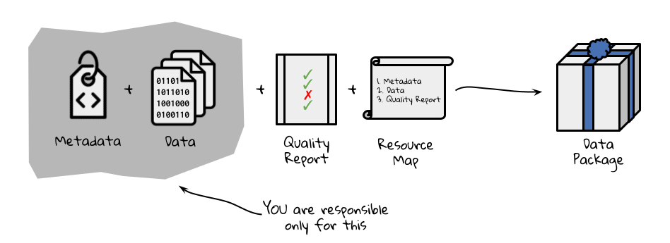

# The Data Package

The data package is the unit of publication within the EDI Data Repository. It's an assemblage of science metadata, one or more science data objects, a package quality report, and manifest of contents. Each data package is assigned a Digital Object Identifier (DOI) and published in the repository for future use.

[TOC]

## Features of a data package {#features-of-a-data-package}

Data packages have some important features. First, they're immutable which makes them suitable for reproducible research. Second, data packages are versionable thereby accommodating updates and improvements through time. Finally, data packages are citable through globally unique and persistent DOIs.

## Example data package {#example-data-package}

[Here's an example](https://portal.edirepository.org/nis/mapbrowse?scope=edi&identifier=9) of what a data package looks like once published in the EDI Repository.

## What to include in a data package

When publishing data in support of a manuscript, include the data required to reproduce the results. Consider publishing this data in a minimally processed form, so it can be reused in other contexts. To make results reproducible, include any scripts used in processing and analyzing the data. Be sure to include links to any external source data used in a data package with [provenance metadata](https://docs.google.com/document/d/1ytbqK72auywo0CX23TBG1L4rv7FmwedA0YIX8EBvB_Q/edit?usp=sharing).

If a data publication is not part of a manuscript, but serving general data reuse, then see our information management resource on [designing a data package](https://docs.google.com/document/d/1Mk_crVVw5uwQNG4oZTt4-cjFgW6exJXGOJ1HSb50SYQ/edit?usp=sharing).

## Identifiers of a data package {#identifiers-of-a-data-package}

### Digital Object Identifier (DOI) {#digital-object-identifier-doi}

The DOI is a globally unique and persistent identifier that unambiguously resolves to the data package [landing page](https://docs.google.com/document/d/1fYIJAKFaA4lPyqo6Rz0ZSEUKKiNMLF5UZCxlyUfhxwM/edit?usp=sharing). DOIs are used in citations and references of a data package.

Example DOI: **doi:10.6073/pasta/0cd8caf2eb9959c98b335828628914fb**

### Data package identifier {#data-package-identifier}

The data package identifier is used exclusively within the EDI Data Repository to associate the components of a data package. A data package identifier has the form **scope.identifier.revision**, where:

* **scope** is a string value that identifies the organization, project, or theme of the data package
* **identifier** is an integer value that uniquely identifies the data package in the namespace of the scope
* **revision** is an integer value in increasing order that identifies the version of the data package

Example data package identifier: **edi.1072.1**

### Data object identifier {#data-object-identifier}

Individual data objects within a data package can be referenced and downloaded using the corresponding data object identifier. This value is hyperlinked to each data object listed under the [Download Data](https://docs.google.com/document/d/1fYIJAKFaA4lPyqo6Rz0ZSEUKKiNMLF5UZCxlyUfhxwM/edit#heading=h.pxflb3dtsjsf) section of the data package landing page and listed under the [Data Entity](https://docs.google.com/document/d/1fYIJAKFaA4lPyqo6Rz0ZSEUKKiNMLF5UZCxlyUfhxwM/edit#heading=h.a8wxh1c77yym) section of the data package full metadata page.

Example data object identifier: **https://portal.edirepository.org/nis/dataviewer?packageid=edi.1100.1&entityid=63bea300d6a56a7f88986f0262ae5e74**

## Versioning data packages {#versioning-data-packages}

The EDI Data Repository enforces strong versioning (i.e. published data and metadata are immutable). Each revision of a data package is published under a new version number.

In the example above **edi.10.1** is superseded by **edi.10.2**, which in turn is superseded by **edi.10.3**. Each version in this series is accessible under the data package landing page [previous revision](https://docs.google.com/document/d/1fYIJAKFaA4lPyqo6Rz0ZSEUKKiNMLF5UZCxlyUfhxwM/edit#heading=h.i1vl6m1pmxvz) link, but only the newest version is returned when searching. If browsing a superseded version, the landing page will highlight that "**This data package is not the most recent revision of a series"**.

See the page on [updating a data package](https://docs.google.com/document/d/1OfT_XMpTbRhJNSMWMC7wcsNm71m2KOYEibEgW15rUew/edit#) for more on this topic.
